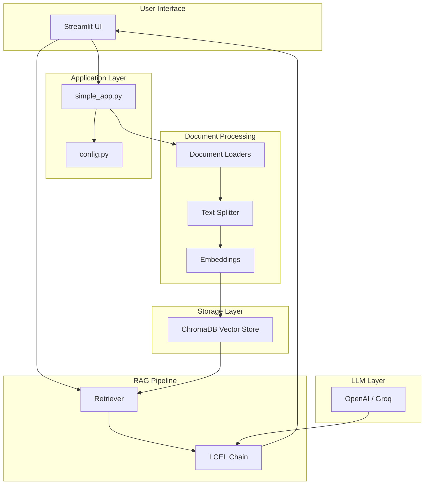
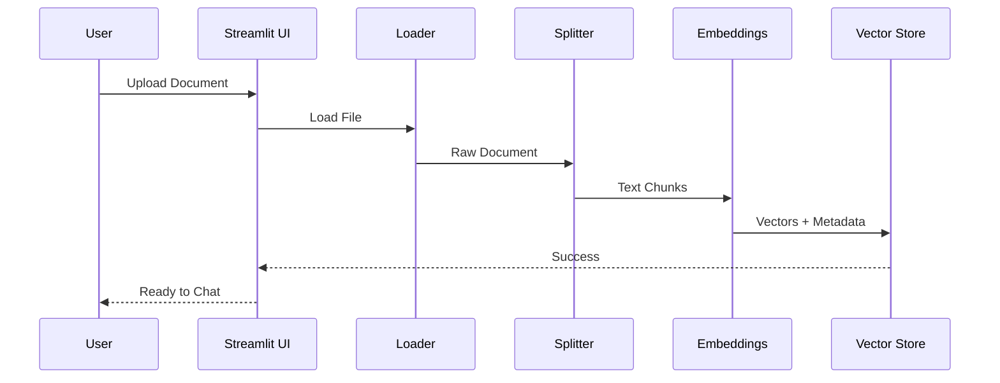
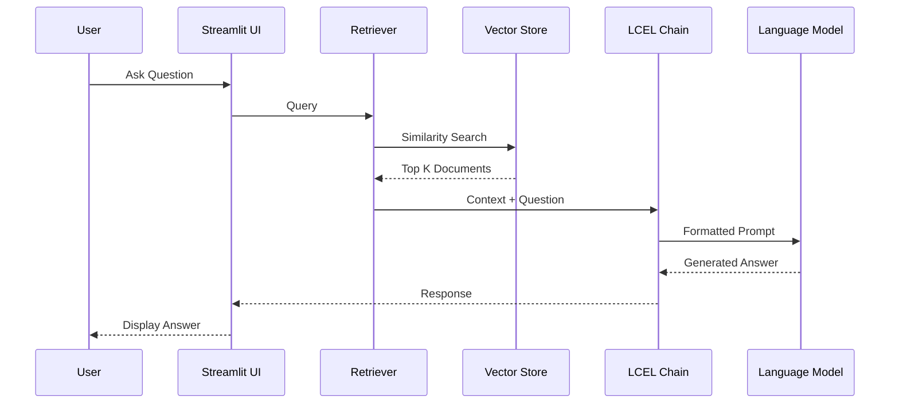

# Architecture Documentation

## System Overview

The GenAI_Langchain RAG chatbot is built using modern LangChain patterns (LCEL) to create a flexible, maintainable, and scalable document question-answering system.

## High-Level Architecture



## Component Details

### 1. Document Processing Pipeline

**Document Loaders:**
- `PyPDFLoader`: Handles PDF documents
- `TextLoader`: Processes plain text files
- Support for multiple file formats

**Text Splitting:**
- Uses `RecursiveCharacterTextSplitter` for semantic chunking
- Configurable chunk size (default: 1000 characters)
- Overlap between chunks (default: 200 characters)
- Preserves document structure and context

**Embeddings:**
- HuggingFace `sentence-transformers/all-MiniLM-L6-v2`
- Converts text chunks into 384-dimensional vectors
- Runs locally on CPU (no API costs)

### 2. Vector Store

**ChromaDB:**
- Open-source vector database
- Persistent storage on disk
- Fast similarity search using cosine distance
- Metadata filtering capabilities

**Storage Structure:**
```
chroma_store/
├── chroma.sqlite3          # Metadata database
└── [collection_id]/        # Vector embeddings
```

### 3. RAG Chain (LCEL Pattern)

The RAG chain is built using LangChain Expression Language (LCEL) with pipe syntax:

```python
rag_chain = (
    RunnableParallel({
        "context": retriever | format_docs,
        "question": RunnablePassthrough(),
        "chat_history": lambda x: format_chat_history(...)
    })
    | prompt
    | llm
    | StrOutputParser()
)
```

**Flow:**
1. **Parallel Execution**: Retrieves context, passes question, formats history
2. **Prompt Construction**: Combines all inputs into a structured prompt
3. **LLM Invocation**: Sends to OpenAI/Groq for generation
4. **Output Parsing**: Extracts string response

**Benefits of LCEL:**
- Declarative and composable
- Built-in streaming support
- Automatic retries and fallbacks
- Easy to test and debug

### 4. Configuration Management

**Pydantic Settings:**
- Type-safe configuration
- Environment variable validation
- Default values with constraints
- Automatic .env file loading

**Configuration Hierarchy:**
1. Environment variables (.env file)
2. Default values in config.py
3. Runtime overrides (if needed)

### 5. Conversation Memory

**Session State Management:**
- Stores chat history in Streamlit session state
- Maintains context across multiple queries
- Formats last 6 messages for LLM context

**Memory Structure:**
```python
{
    "messages": [
        {"content": "user question", "is_user": True},
        {"content": "assistant answer", "is_user": False}
    ]
}
```

## Data Flow

### Document Upload Flow



### Query Flow



## Scalability Considerations

### Current Implementation
- Single-user application
- Local vector store
- In-memory session state

### Production Enhancements
1. **Multi-user Support**: Use persistent session storage (Redis)
2. **Distributed Vector Store**: Deploy ChromaDB as a service
3. **Caching**: Implement response caching for common queries
4. **Load Balancing**: Deploy multiple Streamlit instances
5. **Monitoring**: Add observability with LangSmith

## Extension Points

### Adding New LLM Providers

```python
# In config.py
def get_llm():
    if provider == "anthropic":
        return ChatAnthropic(...)
    elif provider == "cohere":
        return ChatCohere(...)
```

### Adding Reranking

```python
from langchain.retrievers import ContextualCompressionRetriever
from langchain.retrievers.document_compressors import CohereRerank

compressor = CohereRerank()
compression_retriever = ContextualCompressionRetriever(
    base_compressor=compressor,
    base_retriever=retriever
)
```

### Adding Streaming

Already supported! Set `ENABLE_STREAMING=true` in .env

## Security Considerations

1. **API Keys**: Stored in .env (gitignored)
2. **Input Validation**: File type and size restrictions
3. **Error Handling**: No sensitive data in error messages
4. **Logging**: Sanitized logs (no API keys)

## Performance Optimization

1. **Chunk Size**: Balance between context and speed
2. **Retrieval K**: More documents = better context but slower
3. **Model Selection**: gpt-3.5-turbo for speed, gpt-4 for quality
4. **Embedding Cache**: Reuse embeddings for same documents
5. **Vector Store Indexing**: ChromaDB automatically optimizes

## Troubleshooting

### Common Issues

**Slow Response Times:**
- Reduce `RETRIEVAL_K`
- Use faster model (gpt-3.5-turbo)
- Enable streaming for better UX

**Out of Memory:**
- Reduce `CHUNK_SIZE`
- Process fewer documents
- Clear vector store periodically

**Poor Answer Quality:**
- Increase `RETRIEVAL_K`
- Adjust `CHUNK_SIZE` and `CHUNK_OVERLAP`
- Use better model (gpt-4)
- Improve prompt template
