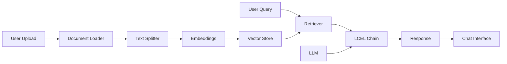

# GenAI_Langchain


A modern **Retrieval-Augmented Generation (RAG)** chatbot built with LangChain, featuring LCEL (LangChain Expression Language) patterns, multiple LLM providers, and an intuitive Streamlit interface.

## ✨ Features

- 🤖 **Modern LCEL Patterns**: Built with LangChain Expression Language for clean, composable chains
- 📚 **Multi-Format Support**: Process PDF, TXT, and DOCX documents
- 🔄 **Multiple LLM Providers**: Support for OpenAI (GPT-3.5, GPT-4) and Groq (Llama 3.1)
- 🎯 **Advanced RAG**: Semantic chunking with RecursiveCharacterTextSplitter
- 💾 **Vector Store**: ChromaDB for efficient similarity search
- 🎨 **Beautiful UI**: Modern Streamlit interface with custom styling
- ⚙️ **Type-Safe Config**: Pydantic-based configuration management
- 📊 **Logging & Monitoring**: Comprehensive logging for debugging
- 🔒 **Secure**: Environment-based API key management

## 🏗️ Architecture



The system uses a modern RAG architecture:
1. **Document Processing**: Uploads are split into semantic chunks
2. **Embedding**: Text chunks are converted to vectors using HuggingFace models
3. **Storage**: Vectors stored in ChromaDB for fast retrieval
4. **Retrieval**: User queries retrieve relevant document chunks
5. **Generation**: LLM generates answers based on retrieved context

## 🚀 Getting Started

### Prerequisites

- Python 3.11 or higher
- OpenAI API key (or Groq API key)
- 4GB+ RAM recommended

### Installation

1. **Clone the repository**
   ```bash
   git clone https://github.com/yourusername/GenAI_Langchain.git
   cd GenAI_Langchain
   ```

2. **Create a virtual environment**
   ```bash
   python -m venv venv
   source venv/bin/activate  # On Windows: venv\Scripts\activate
   ```

3. **Install dependencies**
   ```bash
   cd Text_Mining
   pip install -r requirements.txt
   ```

4. **Configure environment variables**
   ```bash
   # Copy the example environment file
   cp ../.env.example ../.env
   
   # Edit .env and add your API keys
   # Required: OPENAI_API_KEY=your_key_here
   # Optional: GROQ_API_KEY=your_groq_key
   ```

### Running the Application

```bash
cd Text_Mining/chatbot
streamlit run simple_app.py
```

The application will open in your browser at `http://localhost:8501`

## 📖 Usage

1. **Upload Documents**: Use the sidebar to upload PDF, TXT, or DOCX files
2. **Wait for Processing**: The app will automatically create embeddings
3. **Ask Questions**: Type your questions in the chat interface
4. **Get Answers**: Receive contextual answers based on your documents

### Example Questions

- "What is the main topic of this document?"
- "Summarize the key points"
- "What does it say about [specific topic]?"

## ⚙️ Configuration

Edit the `.env` file to customize:

```env
# Model Selection
DEFAULT_MODEL=gpt-3.5-turbo  # or gpt-4, llama-3.1-70b-versatile
MODEL_TEMPERATURE=0.1

# RAG Parameters
CHUNK_SIZE=1000
CHUNK_OVERLAP=200
RETRIEVAL_K=4

# Features
ENABLE_STREAMING=true
ENABLE_RERANKING=false
```

### Supported Models

**OpenAI:**
- `gpt-3.5-turbo` (fast, cost-effective)
- `gpt-4` (highest quality)
- `gpt-4-turbo` (balanced)

**Groq (requires GROQ_API_KEY):**
- `llama-3.1-70b-versatile`
- `mixtral-8x7b-32768`

## 🛠️ Technologies Used

| Technology | Purpose |
|------------|---------|
| **LangChain 0.3** | LLM framework with LCEL patterns |
| **Streamlit** | Web interface |
| **ChromaDB** | Vector database |
| **HuggingFace** | Embedding models |
| **OpenAI / Groq** | Language models |
| **Pydantic** | Configuration management |

## 📁 Project Structure

```
GenAI_Langchain/
├── Text_Mining/
│   ├── chatbot/
│   │   ├── simple_app.py      # Main Streamlit application
│   │   └── config.py          # Configuration management
│   ├── Langchain-tutorial/    # Tutorial notebooks
│   ├── Learn_docker/          # Docker examples
│   └── requirements.txt       # Python dependencies
├── .env.example               # Environment template
├── .gitignore                 # Git ignore rules
└── README.md                  # This file
```

## 🐛 Troubleshooting

### Common Issues

**"OpenAI API key not found"**
- Ensure `.env` file exists in the project root
- Verify `OPENAI_API_KEY` is set correctly
- Restart the Streamlit app

**"Error creating vector store"**
- Check that documents are uploaded successfully
- Ensure sufficient disk space for ChromaDB
- Try reducing `CHUNK_SIZE` in `.env`

**Import errors**
- Verify all dependencies are installed: `pip install -r requirements.txt`
- Check Python version: `python --version` (should be 3.11+)

### Performance Tips

- Use smaller models (gpt-3.5-turbo) for faster responses
- Reduce `RETRIEVAL_K` for quicker searches
- Enable `ENABLE_STREAMING` for better UX
- Use Groq for faster inference (free tier available)

## 🤝 Contributing

Contributions are welcome! Please feel free to submit a Pull Request.

1. Fork the repository
2. Create your feature branch (`git checkout -b feature/AmazingFeature`)
3. Commit your changes (`git commit -m 'Add some AmazingFeature'`)
4. Push to the branch (`git push origin feature/AmazingFeature`)
5. Open a Pull Request

## 📄 License

This project is licensed under the MIT License - see the LICENSE file for details.

## 🙏 Acknowledgments

- Built with [LangChain](https://langchain.com/)
- UI powered by [Streamlit](https://streamlit.io/)
- Vector store by [ChromaDB](https://www.trychroma.com/)
- Embeddings from [HuggingFace](https://huggingface.co/)

## 📞 Support

For questions or issues, please open an issue on GitHub.

---

<p align="center">Made with ❤️ using LangChain & Streamlit</p>
